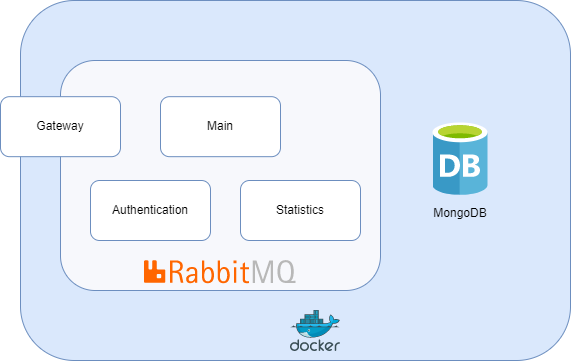
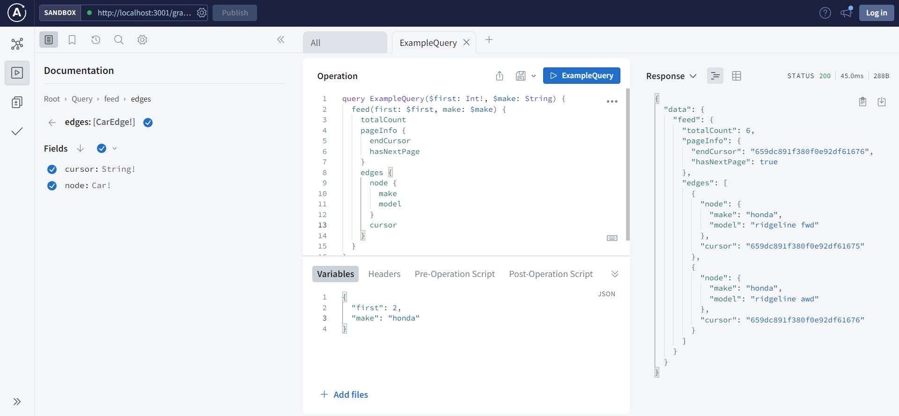

# Car-Showcase Microcervices App

  

A server for **[Car Showcase](https://github.com/cyrusrose/car_showcase)** webclient. It's a NestJs monorepo with several microservices.

## Microsevices

-   [Gateway](./apps/gateway/).
-   [Main app](./apps/chat_server/).
-   [Authentication app](./) - in development.
-   [Statistics app](./apps/statistics/).

## Description

In this branch you'll find:

-   **NestJs**.
-   **Prisma** ORM.
-   **Relay**-based pagination
-   **Apollo Server** with GraphQL code-first approach.
-   **MongoDB** Bitnami replicaset.
-   **Rabbit MQ**.
-   **Joi** for schema validation.
-   **ESLint** for one code theme.

## Screenshots

Query examples:

  

#

-   Some useful commands are present in `README.bash` file.
-   Built in VSCode with WSL
